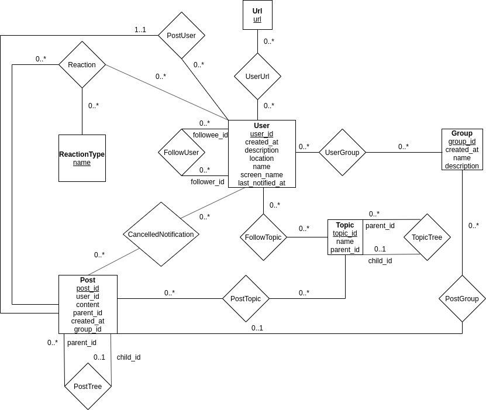
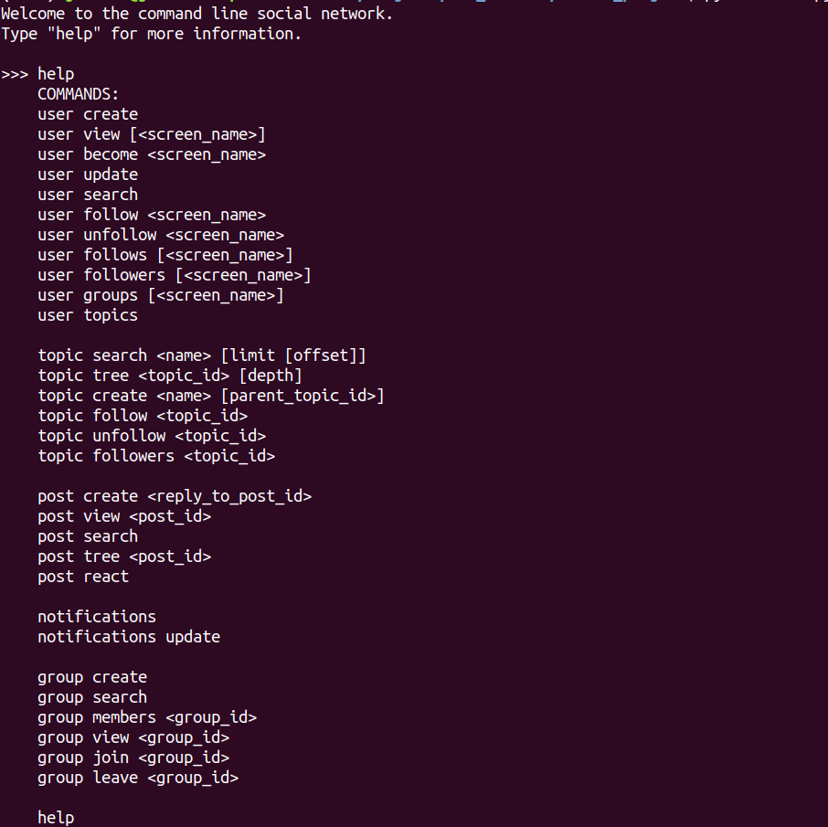

# MySQL Social Network Database
This is a social network database implemented using MySQL, with a Python3 API
and command-line client.


## MySQL schema
The MySQL schema is normalized to Boyce-Codd Normal Form (BCNF) with the
following entity-relation model:


### Sample data
A sample dataset of approximately 10000000 posts from 70000 users can be
obtained from Twitter using the scripts in `twitter_dataset/`.

### Populating the database
A local MySQL instance can by populated with the sample dataset using the
scripts in `populate_database/`. 

## Python3 API
The database can be accessed via an API written using the standard MySQL
connector for Python3. It supports the following features:
* creating users
* creating user groups
* following users
* creating posts
* replying to posts and other replies (organized recursively into a hierarchy)
* reacting to posts and replies (like, love, dislike, etc)
* read and unread flags
* tagging posts with topics (organized recursively into a hierarchy)
* following topics
* searching for posts by author, topics, date created, etc
* notifying a user about posts made since the last time he/she read from
  followed users and/or topics

## Command-line client
A simple client for interacting with the database, using the Python3 API, is
provided in `run.py`.


## Setup for usage and/or development
```Python
python3 -m venv venv
source venv/bin/activate
pip3 install -r requirements.txt
```
